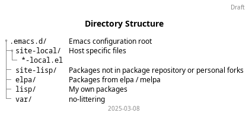

# Emacs Configuration #

Flow of how the configuration gets loaded

Directory structure

## Setup Notes

The configuration expects [no-littering](https://github.com/emacscollective/no-littering) to be present before bootstrapping with use-package. So, first run the `prepare` target and then start emacs.
